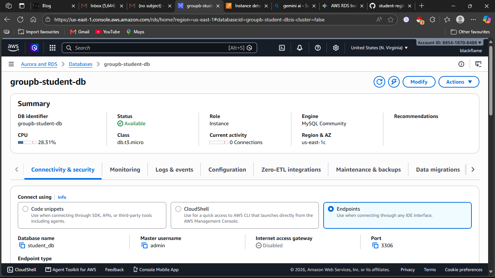
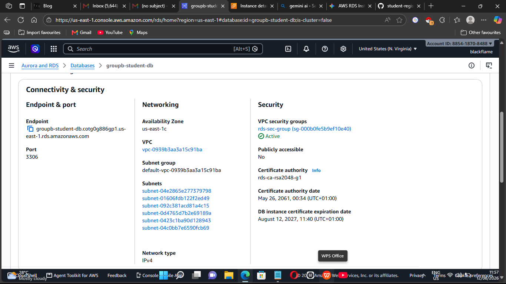
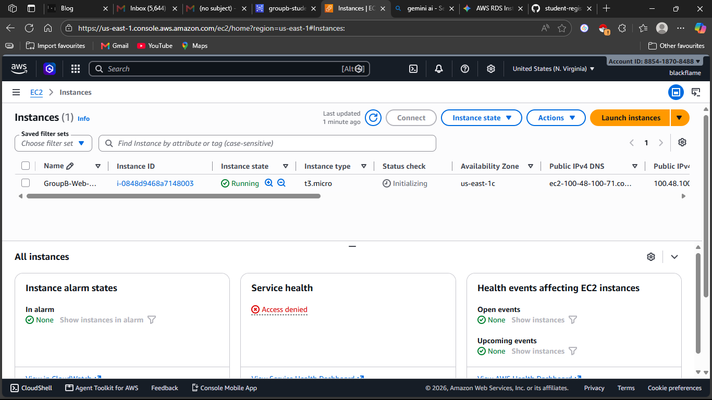
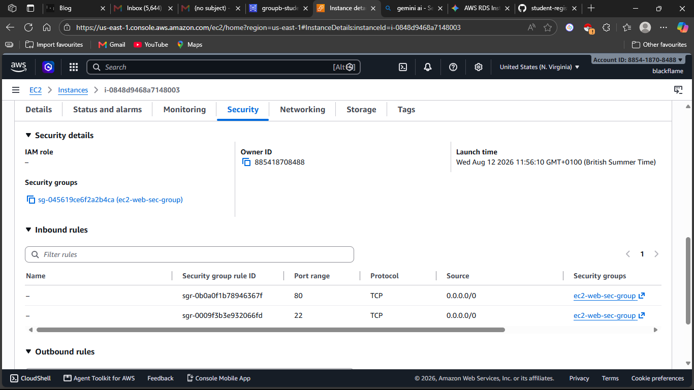
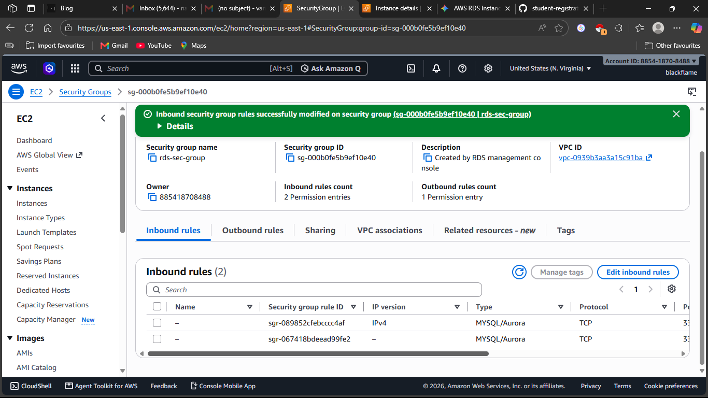

# student-registration-system-groupb
FUTMINNA SIWES AWS Cloud Project — Student Registration System built with PHP, MySQL, and AWS.
# FUTMINNA SIWES AWS Cloud Project: Student Registration System (Group B)

## Project Overview
The **Student Registration System** is a decoupled two-tier web application built using PHP, HTML/CSS, and MySQL, deployed live on Amazon Web Services (AWS) infrastructure.
- **Compute / Web Server:** Apache (`httpd`) and PHP running on an Amazon EC2 Instance (Amazon Linux 2023).
- **Database Server:** Amazon RDS running a managed MySQL database (`groupb-student-db`).
- **Source Code Repository:** GitHub (`spryte-type/student-registration-system-groupb`).

---

## Architecture Diagram
```
[ Internet / User Browser ]
│
▼ (Port 80 HTTP)
┌───────────────────────┐
│    AWS EC2 Instance   │  <-- Apache (httpd) + PHP Web Server
│  (GroupB-Web-Server)  │  <-- App Code (/var/www/html)
└───────────┬───────────┘
│ (Port 3306 MySQL Inbound)
▼
┌───────────────────────┐
│    AWS RDS Instance   │  <-- Managed MySQL Database
│  (groupb-student-db)  │  <-- Database Name: student_db
└───────────────────────┘
```
---

## Database Schema (`schema.sql`)
``sql
CREATE DATABASE IF NOT EXISTS student_db;
USE student_db;

CREATE TABLE IF NOT EXISTS students (
    id INT AUTO_INCREMENT PRIMARY KEY,
    full_name VARCHAR(100) NOT NULL,
    matric_no VARCHAR(30) NOT NULL UNIQUE,
    department VARCHAR(100) NOT NULL,
    email VARCHAR(100) NOT NULL,
    created_at TIMESTAMP DEFAULT CURRENT_TIMESTAMP
);

## Deployment Steps Executed

### Phase 1: Managed Database Provisioning (Amazon RDS)
1. Provisioned an Amazon RDS MySQL instance named `groupb-student-db` using a Single-AZ setup (`db.t3.micro`).
2. Set Master Username as `admin` and disabled Public Access to enforce internal VPC security.
   
3. Created a dedicated security group `rds-sec-group` and initialized database `student_db`.
4. Extracted the live RDS Endpoint address once status changed to **Available**:
   `groupb-student-db.cotg0g886gp1.us-east-1.rds.amazonaws.com`
   

### Phase 2: Compute Provisioning & Security Group Cross-Linking (Amazon EC2)
1. Launched an Amazon EC2 instance named `GroupB-Web-Server` running Amazon Linux 2023 (`t2.micro`).
   
2. Configured security group `ec2-web-sec-group` to allow Inbound traffic on Port 22 (SSH) and Port 80 (HTTP).
   
3. **Cross-Linked Security Groups:** Updated `rds-sec-group` inbound rules to allow MySQL traffic (Port 3306) restricted specifically to `ec2-web-sec-group`.
   

### Phase 3: Server Configuration & App Deployment
1. Connected to EC2 via SSH (`ec2-user@100.48.100.71`) and installed Apache (`httpd`), PHP, `php-mysqlnd`, Git, and the MariaDB/MySQL client tool via `dnf`.
   
2. Cloned application repository directly into web root `/var/www/html/` and structured source files into root directory.
3. Imported `schema.sql` directly into RDS using the command-line client:

   mysql -h groupb-student-db.cotg0g886gp1.us-east-1.rds.amazonaws.com -u admin -p student_db < schema.sql

1. Updated db.php configuration file on EC2 with the live RDS Endpoint URL and connection credentials.

2. Enabled and restarted httpd service to serve the application live on Port 80.

## Challenges Encountered & Solutions
1. Operating System Package Manager Difference
Issue: Running apt commands failed because the EC2 instance was created with Amazon Linux 2023 instead of Ubuntu.

Fix: Switched package management commands to dnf (sudo dnf install php php-mysqlnd mariadb105 git -y) and initialized web server via httpd.

2. Database Backup Retention Limitations
Issue: Database creation threw a Free Tier policy error regarding automated backup retention.

Fix: Adjusted automated backup retention period to 0 days during provisioning.

3. Subfolder Application Routing
Issue: Accessing the EC2 public IP served the default Apache test page ("It works!") because files were nested inside subdirectories (public/, config/, sql/).

Fix: Flattened repository directory structure by moving files from subdirectories directly into /var/www/html/ and updating the database configuration path.

---

### Final Screenshot Checklist

Capture these final screenshots from your AWS Console, PowerShell/Terminal, and Web Browser to complete the submission:

| Category | Screenshot Name | What to Display |
| :--- | :--- | :--- |
| **AWS EC2** | `ec2-instance-summary.png` | EC2 Instances page showing `GroupB-Web-Server` in **Running** state with Public IPv4 (`100.48.100.71`) highlighted. |
| **AWS EC2** | `ec2-security-group.png` | Inbound rules tab of `ec2-web-sec-group` showing Port 22 (SSH) and Port 80 (HTTP) allowed. |
| **AWS RDS** | `rds-database-summary.png` | RDS Databases page showing `groupb-student-db` with Status **Available**. |
| **AWS RDS** | `rds-endpoint.png` | Connectivity & security tab displaying the full Endpoint URL. |
| **AWS RDS** | `rds-security-group.png` | Inbound rules tab of `rds-sec-group` showing Port 3306 allowed from `ec2-web-sec-group`. |
| **Terminal** | `files-and-db-php.png` | Terminal showing output of `ls -la /var/www/html` and `cat /var/www/html/db.php` displaying configured RDS credentials. |
| **Live UI** | `app-home-page.png` | Browser loading `[http://100.48.100.71/](http://100.48.100.71/)` displaying the Student Registration main interface. |
| **Live UI** | `app-crud-actions.png` | Registering a student or performing a search/update action to prove live database persistence. |
